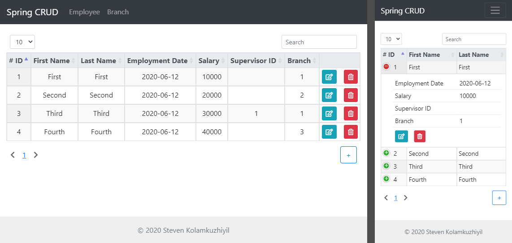

# SpringCRUD

A simple web app which executes CRUD operations and displays the database information in a table. This web application implements various security features such as https, authentication, authorization, user role management, protection against sql injection, xss and csrf. The security features were realised by the use of Spring-Security. The website was built with 
regards to responsive design.

#### User Roles:
- User: Can only view information in the database.
- Manager: Can read, create and update database information.
- Admin: Can read, create, update and delete database information.

#### Application Screenshot - Admin:

## Getting Started

Clone this repository and run the Spring application in an IDE of your choice.

### Used Technologies

Java 8, Spring-Web, Spring-Security, Thymeleaf, Javascript, Datatables, CSS, HTML, Bootstrap, JQuery, Maven, Tomcat
